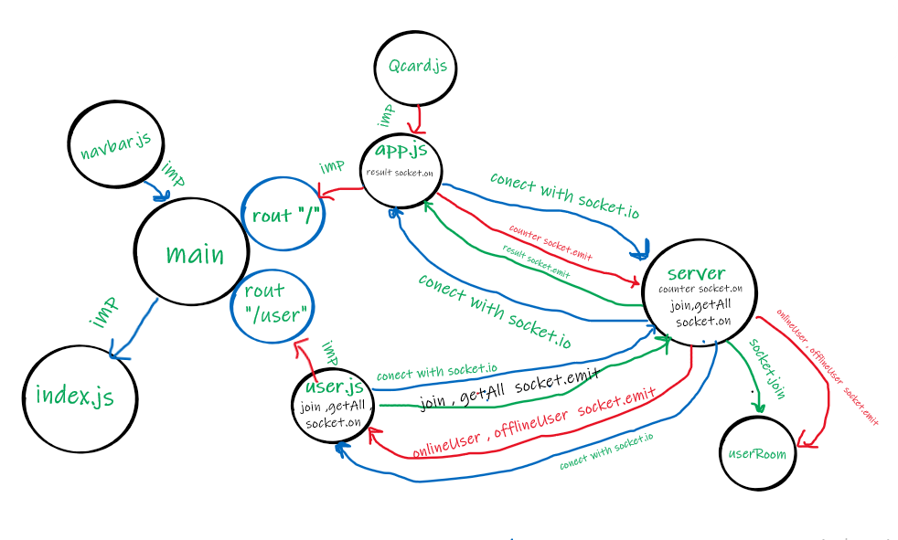

# stress Meter:

deploy a web server using CI and CD and get used to the general process of building and deploying servers.

[master deployed link ](https://rulaalqasem-server-deploy-prod.herokuapp.com/)

[repo link](https://github.com/RulaAlqasem/server-deployment-practice)

How do I install the app or library?

- in the server

* `npm init -y`
* `npm i socket.io`
* ` npm i cors uuid express dotenv`

- in the stress-meter-front
  `npm i bootstrap cors dotenv react-bootstrap react-dom react-router-dom socket.io-client uuid`

How do I run the app?
in the server

- ` nodemon`
  in the stress-meter-front
- ` npm start`

/ : app

/user: profile

uml:

